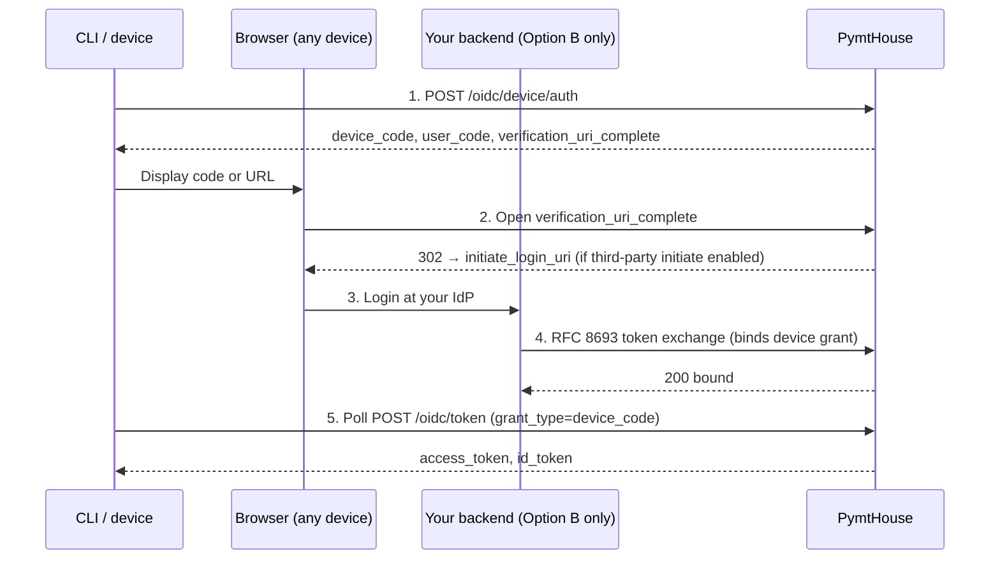

The **device authorization grant** (RFC 8628) lets a CLI, SDK, or any input-constrained device authenticate a user without requiring a browser on the same machine. The device displays a short code or URL; the user completes login on any browser they have available.

PymtHouse extends the standard RFC 8628 flow with optional **third-party initiate login** (OIDC Core §4): unauthenticated users can be redirected to your own login UI instead of PymtHouse's default login page.

## When to use device flow

Use this pattern when:

- Your integration runs as a CLI tool, background daemon, or terminal app.
- The user's device has limited or no browser access at the point of authentication.
- You want to bridge an existing IdP session (NaaP / Option B) into PymtHouse without requiring a second login.

For browser-based authentication, use [Interactive login](/integration/interactive-login) instead.

## Prerequisites

- A **public** OIDC client (`app_…`) with the `device_code` grant enabled.
- If using third-party initiate: `device_third_party_initiate_login` must be enabled on the public client, and an `initiate_login_uri` must be registered.
- If completing the device grant from your backend (Option B): a **confidential M2M client** (`m2m_…`) with `users:token` or `device:approve` scope.

## The full flow



## Step 1 — Request a device code

```bash
curl -sS \
  -H "Content-Type: application/x-www-form-urlencoded" \
  -d "client_id=${PUBLIC_CLIENT_ID}" \
  -d "scope=openid" \
  "${BASE_URL}/api/v1/oidc/device/auth"
```

**Response:**

```json
{
  "device_code": "Ag_EE…long…",
  "user_code": "ABCD-EFGH",
  "verification_uri": "https://your-pymthouse.example/oidc/device",
  "verification_uri_complete": "https://your-pymthouse.example/oidc/device?user_code=ABCD-EFGH&client_id=app_…&iss=https%3A%2F%2F…",
  "expires_in": 600,
  "interval": 5
}
```

**`verification_uri` vs `verification_uri_complete`:**

| Field | Format | Use |
| --- | --- | --- |
| `verification_uri` | Short URL, easy to type | Display when the user will type the code manually |
| `verification_uri_complete` | Full URL with `user_code`, `client_id`, `iss` pre-filled | Use for clickable links, QR codes, and deep-links |

## Step 2 — Display the code to the user

Show either the short URL with the `user_code` to type in, or present the `verification_uri_complete` as a clickable link or QR code.

```
Open https://your-pymthouse.example/oidc/device
and enter the code: ABCD-EFGH

Or scan the QR code / click this link:
https://your-pymthouse.example/oidc/device?user_code=ABCD-EFGH&…
```

## Step 3 — Poll for the token

Begin polling the token endpoint at the `interval` specified in the response. Do **not** poll faster than the interval — the server will respond with `slow_down` and increase the interval.

```bash
while true; do
  RESPONSE=$(curl -sS \
    -H "Content-Type: application/x-www-form-urlencoded" \
    -d "grant_type=urn:ietf:params:oauth:grant-type:device_code" \
    -d "device_code=${DEVICE_CODE}" \
    -d "client_id=${PUBLIC_CLIENT_ID}" \
    "${BASE_URL}/api/v1/oidc/token")

  ERROR=$(echo "${RESPONSE}" | jq -r '.error // empty')

  if [ -z "${ERROR}" ]; then
    echo "Authenticated!"
    ACCESS_TOKEN=$(echo "${RESPONSE}" | jq -r '.access_token')
    break
  elif [ "${ERROR}" = "authorization_pending" ]; then
    sleep 5
  elif [ "${ERROR}" = "slow_down" ]; then
    sleep 10
  else
    echo "Error: ${ERROR}"
    break
  fi
done
```

**Poll response codes:**

| `error` value | Meaning | Action |
| --- | --- | --- |
| `authorization_pending` | User has not yet completed login. | Wait and retry after `interval` seconds. |
| `slow_down` | You are polling too fast. | Increase the polling interval by at least 5 seconds. |
| `access_denied` | User denied the request. | Abort and surface the error. |
| `expired_token` | `device_code` has expired. | Restart the flow with a new device code request. |
| *(no error)* | Authentication complete. | Read `access_token` and `id_token` from the response. |

## Third-party initiate login (Option B / NaaP)

When `device_third_party_initiate_login` is enabled on the public client, unauthenticated users who open `verification_uri_complete` are redirected to your registered **`initiate_login_uri`** with:

```
GET https://yourapp.example/login/initiate
  ?iss=https%3A%2F%2Fyour-pymthouse.example%2Fapi%2Fv1%2Foidc
  &target_link_uri=https%3A%2F%2Fyour-pymthouse.example%2Fapi%2Fv1%2Foidc%2Fdevice%3F…
  &login_hint=<optional>
```

Your `initiate_login_uri` endpoint must:

1. **Validate `iss`** against your discovery document. Reject if it does not equal the expected issuer.
2. **Validate `target_link_uri`** — ensure it points to your PymtHouse origin and the `/oidc/device` path. Reject open redirects.
3. Complete the user's login at your own IdP.
4. Call `POST {issuer}/token` with an RFC 8693 token exchange to bind the device grant (see [Token exchange — device completion](/integration/token-exchange#device-completion)).
5. Show an approval confirmation page or redirect to `target_link_uri`.

<Warning>
  The `initiate_login_uri` is loaded from the database for the `client_id`. The endpoint does **not** accept an arbitrary `initiate_login_uri` query parameter. This is intentional to prevent open-redirect attacks.
</Warning>

### Security requirements for your initiate login endpoint

- Use **HTTPS** in production. HTTP on `localhost` is permitted for local development only.
- Apply **CSRF protection** on any form that triggers your IdP login.
- The OP sets a short-lived per-client cookie so that a failed relying-party round-trip does not loop redirects indefinitely.

## Implied consent

When the user opens `verification_uri_complete` with a pre-filled `user_code`, PymtHouse skips the secondary authorization confirmation step after a successful lookup — the user already authenticated at your site. This improves UX by avoiding double-confirmation for users who completed login through the third-party initiate flow.

## Key design decisions

1. **`verification_uri_complete` carries `iss` alongside `user_code`.** Including the issuer in the URL allows the device verification page to validate that the `user_code` was issued by this deployment and not by a phishing URL. It also enables the third-party initiate redirect to carry context without requiring a server-side lookup.
2. **Redirect target is database-loaded, not URL-provided.** Accepting an arbitrary `initiate_login_uri` query parameter would allow a crafted device-auth link to redirect any user to an attacker-controlled URL. Loading the URI from the client registration prevents this class of open-redirect vulnerability.
3. **Third-party device login must be explicitly opt-in.** Defaulting to a redirect to the relying party would silently change the user experience for every device session. Requiring explicit opt-in means the impact of enabling the feature is deliberate and visible.
4. **RFC 8628 polling semantics are enforced server-side.** `slow_down` responses enforce back-off at the server rather than trusting clients to self-regulate. This protects the token endpoint under high load or misbehaving clients.

## Implementation tasks

- Validate that your device code flow handler parses and acts on every polling error code — particularly `slow_down` and `expired_token`.
- If using third-party initiate, register `initiate_login_uri` as an HTTPS URL; verify it strictly matches `iss` from discovery before trusting any payload.
- Enable CSRF protection on your `initiate_login_uri` handler.
- Do not display `device_code` to the user — it is a server-side opaque token. Display only `user_code` and the verification URLs.
- After binding the device grant with RFC 8693 (Option B), verify the CLI poll returns a successful token before showing the "device approved" page to the browser.
