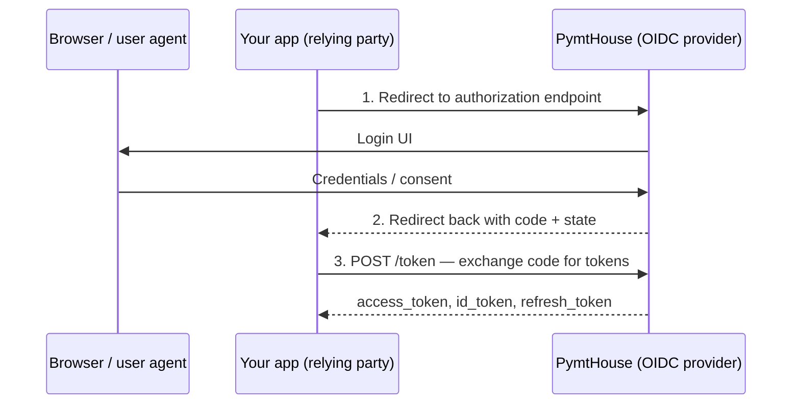

Interactive login uses the **OAuth 2.0 authorization code flow** (RFC 6749 §4.1) to authenticate an end-user in a browser. Public clients must use **PKCE** (Proof Key for Code Exchange, RFC 7636). Confidential server-side clients must authenticate at the token endpoint using their client secret.

## When to use interactive login

Use this pattern when you need:

- A user to authenticate directly through PymtHouse's login UI.
- An ID token or access token tied to the authenticated user session.
- RP-initiated logout (RFC 6749, OIDC Core) to return users to your app after sign-out.

For headless, CLI, or limited-input device scenarios, use [Device flow](/integration/device-flow) instead.

## Prerequisites

- A registered **public** OIDC client (`app_…`) with `authorization_code` grant enabled.
- A registered `redirect_uri` for your application.
- For public clients: PKCE is **required**.
- For confidential server-side clients: client secret is **required** at the token endpoint.

Read endpoints from OIDC discovery at `{issuer}/.well-known/openid-configuration` rather than hard-coding paths.

## The authorization code flow



## Step 1 — Redirect to the authorization endpoint

Construct the authorization URL with the required parameters and redirect the user's browser.

```
GET {issuer}/auth
  ?response_type=code
  &client_id=app_yourClientId
  &redirect_uri=https%3A%2F%2Fyourapp.example%2Fcallback
  &scope=openid
  &state=<random-csrf-token>
  &code_challenge=<S256-challenge>
  &code_challenge_method=S256
```

**PKCE parameters** (required for public clients):

| Parameter | Value |
| --- | --- |
| `code_verifier` | Cryptographically random string, 43–128 chars, URL-safe characters. Store in session. |
| `code_challenge` | `BASE64URL(SHA256(ASCII(code_verifier)))` |
| `code_challenge_method` | `S256` |

**`state` parameter:** Generate a random, opaque value per authorization request and store it in the user's session. Verify it exactly on the callback to prevent CSRF attacks (RFC 6749 §10.12).

**Scopes.** Request only scopes registered on the client. Common values:

| Scope | Purpose |
| --- | --- |
| `openid` | Required to receive an ID token. |
| `profile` | Basic identity claims. |
| `email` | Email address claim. |

### Example: generate PKCE in Node.js

```typescript
import crypto from 'crypto';

function generatePKCE() {
  const verifier = crypto.randomBytes(32).toString('base64url');
  const challenge = crypto
    .createHash('sha256')
    .update(verifier)
    .digest('base64url');
  return { verifier, challenge };
}

const { verifier, challenge } = generatePKCE();
// Store `verifier` in the user session.
// Pass `challenge` in the authorization request.
```

## Step 2 — Handle the callback

PymtHouse redirects the user agent back to your `redirect_uri` with a short-lived authorization `code` and the `state` value you sent.

```
GET https://yourapp.example/callback
  ?code=<authorization-code>
  &state=<your-state-value>
```

Validate the response before proceeding:

1. **Verify `state`** matches the value you stored in the session. Reject if not.
2. **Verify no `error` parameter** is present. Surface the `error_description` to your logging system if present.

## Step 3 — Exchange the code for tokens

```bash
curl -sS \
  -H "Content-Type: application/x-www-form-urlencoded" \
  -d "grant_type=authorization_code" \
  -d "code=${AUTHORIZATION_CODE}" \
  -d "redirect_uri=https://yourapp.example/callback" \
  -d "client_id=${PUBLIC_CLIENT_ID}" \
  -d "code_verifier=${CODE_VERIFIER}" \
  "${BASE_URL}/api/v1/oidc/token"
```

For **confidential server-side clients**, add `client_secret` to the body (or use HTTP Basic auth with `client_id:client_secret` — RFC 7617). Do not send `code_verifier` if you are using a confidential client without PKCE.

**Successful response:**

```json
{
  "access_token": "eyJ...",
  "id_token": "eyJ...",
  "token_type": "Bearer",
  "expires_in": 3600,
  "refresh_token": "pmth_rt_..."
}
```

## Token validation

Validate the `id_token` before creating a user session:

1. Verify the signature using the JWKS published at `{issuer}/jwks`.
2. Verify `iss` matches your configured issuer URL.
3. Verify `aud` contains your `client_id`.
4. Verify `exp` has not passed.
5. Verify `nonce` (if you sent one in the authorization request) to prevent token replay.

Most OIDC client libraries (e.g., `openid-client` for Node.js) handle this automatically when you pass the issuer and client id during initialization.

## Refresh tokens

Refresh tokens (`pmth_rt_…`) allow your app to obtain new access tokens without re-authenticating the user. Exchange a refresh token at the token endpoint:

```bash
curl -sS \
  -H "Content-Type: application/x-www-form-urlencoded" \
  -d "grant_type=refresh_token" \
  -d "refresh_token=${REFRESH_TOKEN}" \
  -d "client_id=${PUBLIC_CLIENT_ID}" \
  "${BASE_URL}/api/v1/oidc/token"
```

Treat refresh tokens as high-value secrets: store them server-side, rotate them on use (PymtHouse uses rotation by default), and revoke them on explicit logout.

## RP-initiated logout

When a user signs out of your app, also terminate the PymtHouse session. Use the `end_session_endpoint` from discovery:

```
GET {issuer}/session/end
  ?post_logout_redirect_uri=https%3A%2F%2Fyourapp.example%2Flogout-success
  &id_token_hint=<id-token>
  &state=<optional-state>
```

`post_logout_redirect_uri` must be pre-registered on the client.

## Error handling

| `error` value | Meaning | Action |
| --- | --- | --- |
| `access_denied` | User denied consent. | Show a friendly message; do not retry automatically. |
| `invalid_request` | Malformed authorization request. | Log the `error_description`; fix the client-side parameter. |
| `invalid_grant` | Code already used, expired, or `redirect_uri` mismatch. | Restart the authorization flow. |
| `unauthorized_client` | The client is not authorized for this grant type. | Check client registration; contact the platform admin. |

## Key design decisions

1. **PKCE is mandatory for public clients.** Without PKCE, authorization codes intercepted by a malicious app or redirect-hijack could be exchanged for tokens by an attacker. RFC 7636 closes this by binding the code to a secret the attacker cannot know.
2. **`state` prevents CSRF.** A missing or incorrectly validated `state` parameter has historically been the most common CSRF vector in OAuth implementations (RFC 6749 §10.12). Treat validation as non-negotiable.
3. **`end_session_endpoint` for single sign-out.** Closing only your local session while leaving the OP session open allows another tab or app to silently re-authenticate the user. RP-initiated logout ensures the OP session terminates alongside your app session.

## Implementation tasks

- Use an established OIDC client library (e.g., `openid-client`, `next-auth`, Passport.js `openid-connect`) rather than implementing the flow manually. Libraries handle signature verification, PKCE, and token validation correctly by default.
- Register every `redirect_uri` your app uses — including localhost for development — in the client configuration. Unregistered URIs are rejected by the token endpoint with `invalid_grant`.
- Store the `code_verifier` in a server-side session or a secure, `HttpOnly` cookie, never in the URL or `localStorage`.
- Implement the full `state` round-trip: generate before redirect, verify on callback, invalidate after single use.
- Enable refresh-token rotation and revoke refresh tokens on explicit logout to limit the impact of token theft.
