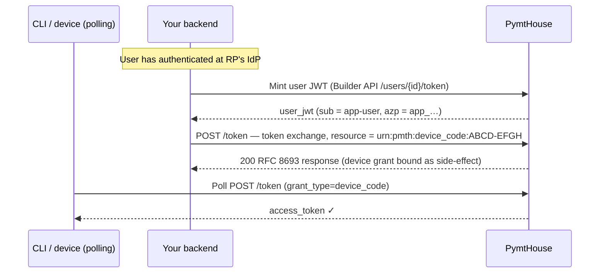

PymtHouse implements the **OAuth 2.0 Token Exchange** grant (RFC 8693) for two distinct server-side operations:

1. **Device completion** — a backend binds a pending RFC 8628 device grant to an authenticated user, completing the CLI authentication flow on behalf of the user without a second browser redirect.
2. **Remote signer session exchange** — a short-lived access token is exchanged for a long-lived opaque remote signer session token (`pmth_*`) scoped to `sign:job`.

Both operations use the same token endpoint (`POST {issuer}/token`) and the same `grant_type`, but with different `resource` values.

## Common parameters

All token exchange requests follow the RFC 8693 parameter structure:

| Parameter | Value |
| --- | --- |
| `grant_type` | `urn:ietf:params:oauth:grant-type:token-exchange` |
| `subject_token_type` | `urn:ietf:params:oauth:token-type:access_token` |
| `subject_token` | A valid access token issued by this PymtHouse issuer |

Authentication: **M2M HTTP Basic auth** (`Authorization: Basic base64(m2m_id:m2m_secret)`) is required for all token exchange calls.

---

## Device completion (RFC 8693 + RFC 8628)

Use this operation in the **NaaP / Option B** flow: after the user authenticates at your backend, call the token endpoint to bind the pending device grant. The polling CLI receives its access token on the next poll.

### Prerequisites

- A confidential M2M client (`m2m_…`) with `device:approve` **or** `users:token` scope.
- `device_third_party_initiate_login` enabled on the **public** client.
- A user-scoped JWT for the **public** `app_…` client (minted via [User tokens](/integration/user-tokens)).

### Flow



### Request

```bash
ISSUER="${BASE_URL}/api/v1/oidc"
M2M_ID="m2m_yourClientId"
M2M_SECRET="pmth_cs_yourSecret"
USER_JWT="eyJ..."      # access_token from user-token mint, azp = public app_… client
USER_CODE="ABCD-EFGH"  # code the CLI received in step 1 of device flow

curl -sS \
  -u "${M2M_ID}:${M2M_SECRET}" \
  -H "Content-Type: application/x-www-form-urlencoded" \
  --data-urlencode "grant_type=urn:ietf:params:oauth:grant-type:token-exchange" \
  --data-urlencode "subject_token=${USER_JWT}" \
  --data-urlencode "subject_token_type=urn:ietf:params:oauth:token-type:access_token" \
  --data-urlencode "resource=urn:pmth:device_code:${USER_CODE}" \
  "${ISSUER}/token"
```

**`resource` format:** `urn:pmth:device_code:<user_code>` — use the `user_code` (e.g. `ABCD-EFGH`), not the `device_code`. PymtHouse normalizes the code before lookup.

### Subject token requirements

The `subject_token` must be:

- A valid JWT issued by **this** PymtHouse issuer (signature verified against `{issuer}/jwks`).
- Issued to the **public** `app_…` client for the same app (`client_id` or `azp` claim = public client id).
- Not expired.

The M2M client's `allowed_scopes` must include `device:approve` or `users:token`. The subject token itself needs no additional special scope for device completion.

### Response

```json
{
  "access_token": "pmth_signer_session_...",
  "issued_token_type": "urn:ietf:params:oauth:token-type:access_token",
  "token_type": "Bearer",
  "expires_in": 86400
}
```

The binding of the device grant is a **side-effect** of this call. The CLI's next poll of the device code token endpoint will return the bound session.

### Mapping subject token → end user

Internally, PymtHouse maps the `subject_token`'s `sub` (app-user id) to an `end_users` record via `findOrCreateAppEndUser` before binding the device grant. This ensures the grant's `accountId` resolves through `findAccount` — which looks up `users` / `end_users` — so that subsequent token operations against the bound grant succeed. The detail is transparent to your integration, but explains why the subject token must belong to the public app client and not be an arbitrary JWT.

---

## Signer session exchange

Use this operation to exchange a short-lived user access token for a long-lived opaque remote signer session token (`pmth_*`).

### Prerequisites

- **HTTP Basic auth** with the confidential **M2M** client (`m2m_…` and secret). The public `app_…` client cannot authenticate this grant.
- The M2M client's `allowed_scopes` must include **`users:token`** (per-user billing). The same scope gates this exchange as for [User tokens](/integration/user-tokens) and device completion.
- The `subject_token` must already contain **`sign:job`** scope.

### Subject token binding

The `subject_token` must be a JWT from this issuer whose `client_id` or `azp` is either:

- The **public** `app_…` client for the same developer app as the authenticating M2M client (typical after interactive login or Builder user-token mint), or
- The same **M2M** `client_id` as the request (legacy `client_credentials` access token used as `subject_token`).

This mirrors device completion: the backend proves possession of the M2M secret while the user token remains bound to the public client.

### Request

```bash
ISSUER="${BASE_URL}/api/v1/oidc"
M2M_ID="m2m_yourClientId"
M2M_SECRET="pmth_cs_yourSecret"
ACCESS_TOKEN="eyJ..."  # user access token with sign:job scope (azp = public app_…)

curl -sS \
  -u "${M2M_ID}:${M2M_SECRET}" \
  -H "Content-Type: application/x-www-form-urlencoded" \
  --data-urlencode "grant_type=urn:ietf:params:oauth:grant-type:token-exchange" \
  --data-urlencode "subject_token=${ACCESS_TOKEN}" \
  --data-urlencode "subject_token_type=urn:ietf:params:oauth:token-type:access_token" \
  --data-urlencode "scope=sign:job" \
  "${ISSUER}/token"
```

Omit `resource`, or set `resource` to the issuer URL (`{issuer}`) if your client always sends a resource indicator (RFC 8707). Do not use `urn:pmth:device_code:…` here — that routes to device completion.

### Security constraints

- **M2M authentication** is required; the subject JWT may be for the public sibling or the same M2M client (see above).
- The `subject_token` must already contain `sign:job` scope. The exchange does not escalate scope.
- Optional RFC 8693 parameters: if `audience` or `requested_token_type` are sent, they must be valid for this exchange (audience must name this authorization server; issued token type is an access token).
- Signer session tokens are long-lived; treat them with the same care as refresh tokens.

### Response

```json
{
  "access_token": "pmth_signer_session_longtoken...",
  "issued_token_type": "urn:ietf:params:oauth:token-type:access_token",
  "token_type": "Bearer",
  "expires_in": 86400
}
```

---

## Error responses

| Status | Condition |
| --- | --- |
| `400 invalid_grant` | `subject_token` is expired, invalid signature, or wrong issuer. |
| `400 invalid_request` | Missing required parameter, or `resource` value not recognized. |
| `401 Unauthorized` | M2M / client credentials invalid. |
| `403 Forbidden` | M2M client lacks the required scope (`device:approve` or `users:token`), or `subject_token` client mismatch. |

---

## Key design decisions

1. **Single token endpoint for both exchange types.** Routing both device completion and signer session exchange through `POST {issuer}/token` with different `resource` values keeps the public surface area minimal and consistent with RFC 8693 semantics. A separate `/device/approve` URL would require registering and documenting yet another endpoint.
2. **`resource` as the dispatch discriminator.** Using `urn:pmth:device_code:<user_code>` as the `resource` signals device completion intent clearly and aligns with RFC 8707 resource indicator semantics, which describe `resource` as identifying the target service or resource.
3. **Binding is a side-effect, not the primary response.** RFC 8693 specifies that the response body contains a token; the device grant binding happens as an implementation side-effect. This means the CLI polls the standard device code endpoint rather than a proprietary callback, keeping device polling logic independent of the Option B backend.
4. **Subject token must carry the public `app_…` client id (device completion).** This constraint ensures that the token used to bind the device grant was issued by the correct app context. Signer session exchange additionally allows a subject JWT issued to the paired M2M client when proving possession of that M2M secret at the token endpoint.

## Implementation tasks

- Mint the user JWT via the Builder API **before** calling the token exchange — the exchange uses it as the `subject_token`.
- Validate that your backend stores the `user_code` from the device code response and passes it verbatim to the `resource` parameter. Case and separator must match.
- Confirm the M2M client has `device:approve` or `users:token` in `allowed_scopes` before attempting device completion.
- For signer session exchange, verify the `subject_token` contains `sign:job` before calling — the endpoint will reject it otherwise, and you want to surface that early with a clear error.
- Do not retry a device completion exchange with the same `user_code` after success; the grant has already been bound.
